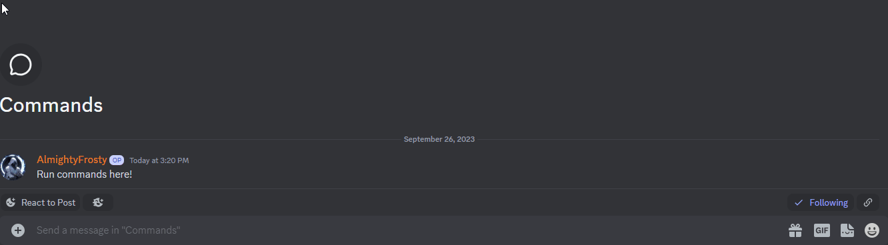
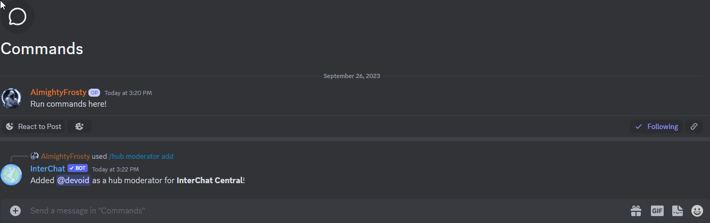

# 🛠️ Manage Moderators

### Adding Moderators

Hub moderators can help you manage your hub. They can invite and blacklist servers, and they can also manage hub settings. To add a moderator, use the `/hub moderator add` command.

There are two roles you can assign to moderators: `Network Moderator` and `Hub Manager`. Hub Managers have full control over the hub, while moderators can only manage hub messages and blacklist users and servers.

**Example:**

### Removing Moderators

To remove a moderator, use the `/hub moderator remove` command. Only the hub owner and managers can remove moderators. And a hub manager can't remove other hub managers or themselves.

#### Example:

