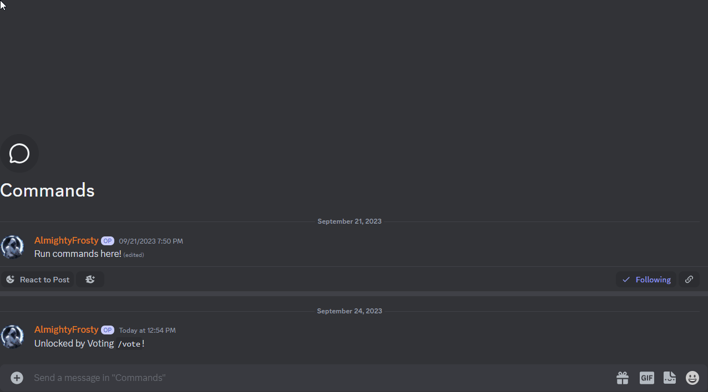

# Messaging

Learn the basics of sending, deleting, editing, replying to messages and reporting messages or users using InterChat.

Your message will be sent to the channel you are in and will be visible to every server present in the hub. You can now engange in conversations by being responsive to messages and participating in discussions.

```
This is an example how your message might look like in the hub:


```

## Replying to Messages

InterChat's intuitive reply feature allows you to respond to messages sent in the past 24 hours easily. Here's how:

InterChat will handle the rest, ensuring your reply is properly linked to the original message. !\[]\(/images/MsgReply.gif)

### Editing Messages

Whether a typo snuck into your message or your cat decided to join the conversation, InterChat allows you to edit your message across servers with ease. You can only edit messages that were created in the past 24 hours. 

### Deleting Messages

Deleting messages is just as easy. A hub moderator can delete messages sent in their hub and as well the message authors for their own messages. Only messages that have been sent in the past 24 hours can be deleted.

## Reporting Messages & Users

If you come across inappropriate content or users, InterChat provides options to report them. Right-click on the message you wish to report and select `Message Info/Report` from the Apps context menu. Please note that this feature only works for messages sent to hubs that have the report feature enabled.

> 

Alternatively, you can use the `/support report` command to report any other issues. Happy chatting!
