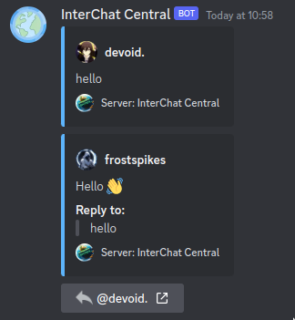

# 💬 Sending Messages

Your message will be sent to the channel you are in and will be visible to every server present in the hub. You can now engage in conversations by being responsive to messages and participating in discussions.

<figure><figcaption>
An example how your message might look like in a hub.
</figcaption></figure>
