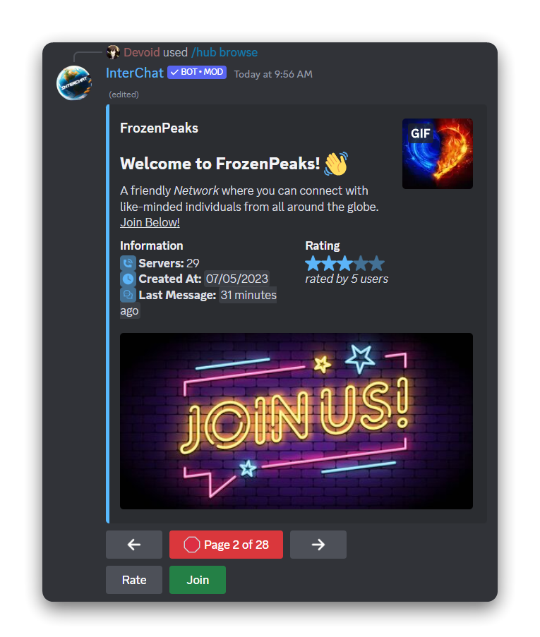

# 🚀 Get Set Up


Invite InterChat here: [https://interchat.fun/invite](https://interchat.fun/invite)

Ensure the the following permissions are granted to the bot:

* Send Messages
* Manage Messages
* Manage Webhooks
* Embed Links


## Discover and Join Hubs

To find and join a public hub[^1]:

1. Type `/hub browse` to view the available hubs.
2. Use the arrow keys to navigate through the options.
3. When you find a hub that sparks your interest, click on 'Join'.
4. Choose your preferred channel to connect it to the hub.

<figure><figcaption>
Hubs that are visible publicly can be paginated througheasily using the left and right arrow buttons.
</figcaption></figure>

### Joining a Private Hub

If you have an invite code for a private hub, follow these steps:

1. Enter the command: `/hub join invite:<invite code>`

### Switching Hubs

Before joining a new hub, you need to leave your current hub. Here's how:

* Disconnect from your current hub.
* Use the joining instructions in the "Joining a Hub" section for the new hub.

## Pausing Connection with a Hub

To stop messages from coming in or going out to a hub:

* Type `/connection` to temporarily disconnect.
* Use the same command to reconnect when you're ready.

This ensures you won't send or receive messages with the hub while disconnected.

<figure><figcaption></figcaption></figure>

## Permanently Leaving a Hub

To permanently leave a hub, enter the command `/hub leave`. If you decide to rejoin later, use `/hub join`

<figure><figcaption></figcaption></figure>

Now you're all set to chat seamlessly across different servers! 🚀

[^1]: Hub is a chat space on InterChat where various other servers can come to chat together.
